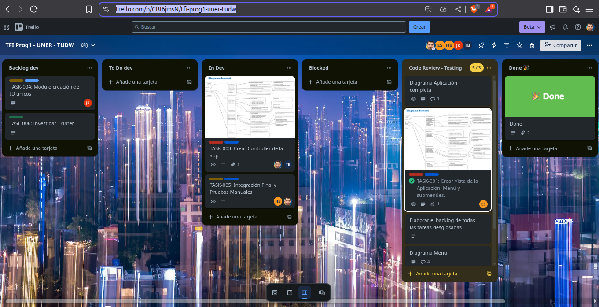

#### Trabajo Final Integrador

### UNER - FCAD - Programación 1 - 2025

## Sistema de Gestión de Talleres Escolares

# 📌 Sistema de Gestión de Talleres Escolares (TFI - Programación I)

Este repositorio contiene el Trabajo Final Integrador para la materia **Programación I** de la carrera de Desarrollo Web en la UNER.

## Organización del equipo

A modo de emular un entorno de trabajo bajo metodologías ágiles se trabajó con este tablero de [Trello](https://trello.com/b/CBI6jmsN/tfi-prog1-uner-tudw), del cual aquí presentamos una muestra:



## 🎯 **Objetivo del proyecto**

Desarrollar una aplicación en Python que permita gestionar:

- Usuarios (estudiantes, personal, administradores)
- Herramientas y máquinas
- Asignaciones y préstamos
- Mantenimientos

Con persistencia de datos en archivos `.json` y arquitectura **MVC**.

## 📊 Diagramas del proyecto

A continuación se incluyen los diagramas elaborados para este TFI:

Diagrama de Menú: Estructura jerárquica de opciones disponibles en el sistema.


Diagrama de Arquitectura: Muestra la relación entre módulos y flujo de datos.


---

## 🗂️ **Estructura de Carpetas**

```
/TFI
│
├── model/               # Módulo Modelo: CRUD y manejo de archivos JSON
│   ├── model_users.py
│   ├── model_tools.py
│   ├── model_maintenances.py
│   ├── model_loans.py
│
├── controller/          # Módulo Controlador: Lógica de negocio y validaciones
│   ├── controller_user.py
│   ├── controller_tools.py
│   ├── controller_maintenances.py
│   ├── controller_loans.py
│
├── view/                # Módulo Vista: Menús y entradas por consola
│   ├── menu.py
│
├── data/                # Archivos de persistencia de datos
│   ├── user.json
│   ├── tools.json
│   ├── maintenances.json
│   ├── loans.json
│
├── main.py              # Punto de entrada principal del sistema
├── README.md            # Documentación del proyecto
```

## ⚙️ **Tecnologías utilizadas**

- Python 3.x
- Archivos JSON para persistencia de datos
- Estructura MVC (Model-View-Controller)

## 🚀 **Cómo ejecutar**

1. Clonar o descargar este repositorio.

2. Abrir la terminal en la carpeta raíz del proyecto.

3. Ejecutar el archivo principal:

   ```bash
   python main.py
   ```

4. El archivo `main.py` importa y ejecuta el menú principal definido en `view/menu.py`.

5. Seguir las instrucciones en pantalla.

## ✅ **Funciones principales**

- **Usuarios**: crear, editar, buscar y eliminar.
- **Herramientas**: registrar, buscar, cambiar estado, editar y eliminar.
- **Asignaciones**: registrar préstamo y devolución, historial por usuario o herramienta.
- **Mantenimientos**: registrar y consultar historial.

## 👥 **Autores**

Trabajo realizado por el **Grupo Nº1** de la cátedra de Programación I - Desarrollo Web - UNER.

## 📄 **Licencia**

Uso educativo, sin fines comerciales.
